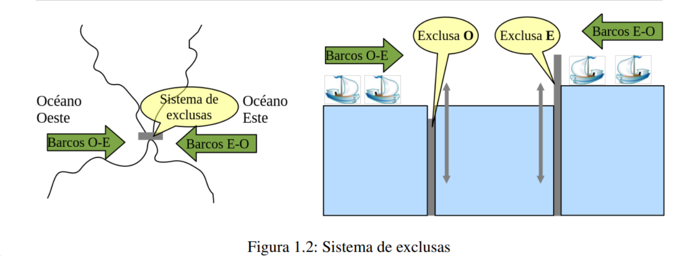

El sistema a simular está compuesto por un sistema de exclusas en un istmo, que permite a los
barcos cruzar desde un Océano hacia otro, como se muestra en la siguiente Figura 1.2:

Las exclusas funcionan del siguiente modo:

* Cuando hay dos o más barcos esperando para cruzar en uno de los dos lados, el sistema
  intenta hacer que éstos crucen y lo hagan de a dos.
* Para ello, si no hay ningún otro barco cruzando, la exclusa correspondiente se baja siempre
  que la otra esté levantada.
* Al bajar la exclusa, los barcos que esperaban pueden pasar al interior del canal exclusivamente
  de a dos, una vez allí, deben esperar hasta que se levante la exclusa que acaban de atravesar y
  esperar que baje la otra; seguidamente los dos barcos pueden cruzar hacia su destino final (el
  otro océano).
* Una vez que acaban de atravesar éstos, recién pueden hacerlo otros dos barcos que estén
  esperando del otro lado.
* Esto último quiere decir que sólo dos barcos que crucen en el mismo sentido pueden estar en
  el interior del canal en un momento determinado.

Ud. debe proveer un modelo de simulación de este sistema utilizando sockets con n barcos (cliente)
O-E y m barcos E-O (cliente) que intentan realizar el paso. Ademas debe proveer el sistema de
exclusa (servidor), que sincronice lo solicitado.